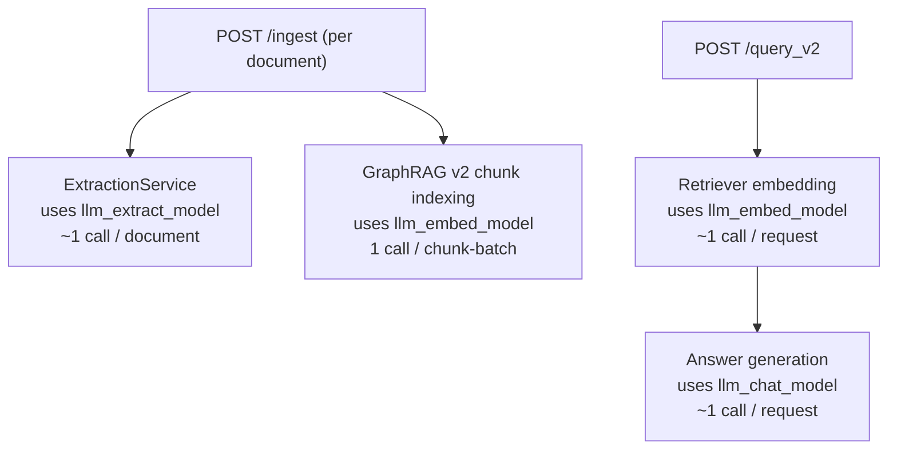

# Dynamic Local GraphRAG for Cybersecurity Docs

This service builds and queries a Neo4j knowledge graph from cybersecurity PDFs and vendor URLs.
It supports Ollama, OpenAI, and Google Gemini via provider-based LLM settings and exposes a FastAPI interface for ingestion, temporal refresh, and GraphRAG v2 QA.

## Privacy and safety guarantees

- Local-only by default: the app blocks non-local LLM endpoints unless explicitly enabled.
- No autonomous actions: responses are recommendation/hypothesis only.
- Evidence-first answering: answers are returned with graph path evidence and source citations.

## Stack

- FastAPI backend
- Neo4j graph database
- Provider-based LLM integration (`ollama`, `openai`, `gemini`)
- RAGAS-based faithfulness metric and WildGraphBench-compatible output adapter

## Quick start

1. Copy env file:
   - `cp .env.example .env`
2. Start Neo4j:
   - `docker compose up -d`
3. Install dependencies:
   - `pip install -r requirements.txt`
4. Run API:
   - `uvicorn app.main:app --reload --host 0.0.0.0 --port 8000`

## API endpoints

- `GET /` health + privacy mode
- `POST /ingest` with payload:
  - `pdf_paths`: local file paths
  - `urls`: vendor documentation URLs
- `POST /query_v2` for Neo4j GraphRAG Python + vector retrieval (`nomic-embed-text`)
- `POST /temporal/update` to trigger stale-source refresh

## LLM usage and cost map

- `llm_extract_model` is used during ingestion/extraction, usually the highest cost for large ingest jobs.
- `llm_embed_model` is used for vector indexing and vector retrieval.
- `llm_chat_model` is used for `/query_v2` final answer synthesis.

Approximate call counts:

- One `POST /ingest` for one document: `extract_model ~= 1`, `embed_model ~= 1` (for chunk batch embedding).
- One `POST /query_v2`: `embed_model ~= 1` and `chat_model ~= 1`.

## v1 deprecation note

The legacy v1 Cypher QA path (`/query`, `GraphCypherQAChain`) was tested and removed from this repository.

Observed behavior in local tests after URL/PDF ingestion:
- It frequently failed to produce valid Cypher for ingested resources.
- This caused unstable query execution and unreliable graph-based answers.

The project now keeps only GraphRAG v2 (`/query_v2`) for ingestion/query workflows.

Quick monthly estimate:

- `monthly_cost ~= sum(model_calls_i * avg_tokens_i / 1_000_000 * price_per_1M_tokens_i)`
- For precise numbers, add request logging of token usage per endpoint and aggregate by model.

## Temporal update loop

- Each source stores `last_updated`, `etag`, and `content_hash`.
- A scheduler periodically checks HTTP metadata.
- Stale sources are re-ingested and older graph state is marked superseded.

## Evaluation

Run evaluation on a real benchmark dataset:

- `PYTHONPATH=. python eval/run.py --dataset /absolute/path/to/benchmark_dataset.json`

Artifacts:

- Use benchmark-scoped folders under `eval/`, for example:
  - `eval/WildGraphBench/*.json`
  - `eval/<benchmarkName>/*.json`
- Default report output is `eval/benchmarkName/report.json` (override with `--output`).
- The repository no longer ships synthetic/sample benchmark JSON files; keep only real benchmark datasets and generated evaluation outputs.

WildGraphBench integration:

- Use `eval/wildgraphbench.py` to export predictions and compare with external benchmark/SOTA outputs.
- Use `eval/wildgraphbench_run.py` for end-to-end WildGraphBench runs:
  1. Build graph from `corpus/*/*/reference_pages/*.txt`
  2. Run QA from `QA/*/questions.jsonl`
  3. Export predictions JSONL for official WildGraphBench scoring

Example:

- API mode (recommended, uses `/ingest` and `/query_v2`; requires running FastAPI server):
  - `PYTHONPATH=. python eval/wildgraphbench_run.py --mode api --api-base-url http://localhost:8000 --wildgraphbench-root /absolute/path/to/WildGraphBench --domain technology --output-dir eval/WildGraphBench`
- Local in-process mode:
  - `PYTHONPATH=. python eval/wildgraphbench_run.py --mode local --wildgraphbench-root /absolute/path/to/WildGraphBench --domain technology --output-dir eval/WildGraphBench`

Configuration override options for benchmark runs:

- Use alternate YAML settings file:
  - `... python eval/wildgraphbench_run.py ... --settings-yaml /absolute/path/to/benchmark_settings.yaml`
- Override individual settings directly in CLI (takes precedence over YAML and defaults):
  - `... python eval/wildgraphbench_run.py ... --neo4j-uri bolt://localhost:7687 --neo4j-username neo4j --neo4j-password pass --llm-provider ollama --llm-base-url http://localhost:11434 --llm-chat-model qwen2.5:14b`

Then run official benchmark scoring against generated predictions:

- `python tools/eval.py --gold /absolute/path/to/WildGraphBench/QA/technology/questions.jsonl --pred eval/WildGraphBench/predictions_technology.jsonl --outdir eval/WildGraphBench/official_scores_technology`

For reproducible experiment tracking (run folders, logs, parameter card template), see:

- `eval/README.md` ("Reproducible experiment logging")

## GraphRAG v2 notes

- v2 uses `neo4j-graphrag-python` retriever flow with chunk embeddings stored on `Chunk.embedding`.
- Default embedding model is `nomic-embed-text` (configure in `settings.yaml`).
- Native GraphRAG generation currently runs with Ollama; for other providers, v2 falls back to vector retrieval + provider chat synthesis.
- Ensure vector dimensions in settings match the selected embedding model.
