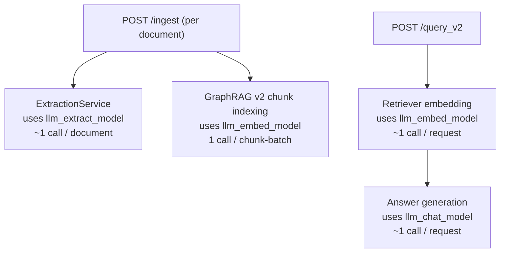

# GraphoDynamo — Dynamic Local GraphRAG for Cybersecurity Docs

**GraphoDynamo** builds and queries a Neo4j knowledge graph from cybersecurity PDFs and vendor URLs.
It supports Ollama, OpenAI, and Google Gemini via provider-based LLM settings and exposes a FastAPI interface for ingestion, temporal refresh, and GraphRAG v2 QA.

**Status.** GraphoDynamo is end-to-end wired for **WildGraphBench** (ingest reference pages, run `/query_v2`, export predictions, official scoring). On the **technology** domain, a **`gpt-oss:120b`**-built graph with **`gpt-oss:120b`** end-to-end answering and **GDS-based graph enrichment** reaches **66.07%** single-fact and **57.58%** multi-fact accuracy under the stored official reports — the **best** Ave. Acc. and Multi-fact Acc. on the comparison table below (see *WildGraphBench — technology domain (results)*).

## Privacy and safety guarantees

- Local-only by default: the app blocks non-local LLM endpoints unless explicitly enabled.
- No autonomous actions: responses are recommendation/hypothesis only.
- Evidence-first answering: answers are returned with graph path evidence and source citations.

## Stack

- FastAPI backend
- Neo4j graph database
- Provider-based LLM integration (`ollama`, `openai`, `gemini`)
- RAGAS-based faithfulness metric and WildGraphBench-compatible output adapter

## Quick start

1. Copy env file:
   - `cp .env.example .env`
2. Start Neo4j:
   - `docker compose up -d`
3. Install dependencies:
   - `pip install -r requirements.txt`
4. Run API:
   - `uvicorn app.main:app --reload --host 0.0.0.0 --port 8000`

## API endpoints

- `GET /` health + privacy mode
- `POST /ingest` with payload:
  - `pdf_paths`: local file paths
  - `urls`: vendor documentation URLs
- `POST /query_v2` for Neo4j GraphRAG Python + vector retrieval (`nomic-embed-text`)
- `POST /temporal/update` to trigger stale-source refresh

## LLM usage and cost map

- `llm_extract_model` is used during ingestion/extraction, usually the highest cost for large ingest jobs.
- `llm_embed_model` is used for vector indexing and vector retrieval.
- `llm_chat_model` is used for `/query_v2` final answer synthesis.

Approximate call counts:

- One `POST /ingest` for one document: `extract_model ~= 1`, `embed_model ~= 1` (for chunk batch embedding).
- One `POST /query_v2`: `embed_model ~= 1` and `chat_model ~= 1`.

## v1 deprecation note

The legacy v1 Cypher QA path (`/query`, `GraphCypherQAChain`) was tested and removed from this repository.

Observed behavior in local tests after URL/PDF ingestion:
- It frequently failed to produce valid Cypher for ingested resources.
- This caused unstable query execution and unreliable graph-based answers.

The project now keeps only GraphRAG v2 (`/query_v2`) for ingestion/query workflows.

Quick monthly estimate:

- `monthly_cost ~= sum(model_calls_i * avg_tokens_i / 1_000_000 * price_per_1M_tokens_i)`
- For precise numbers, add request logging of token usage per endpoint and aggregate by model.

## Temporal update loop

- Each source stores `last_updated`, `etag`, and `content_hash`.
- A scheduler periodically checks HTTP metadata.
- Stale sources are re-ingested and older graph state is marked superseded.

## Knowledge graph pipeline

### How the graph is built

Each `POST /ingest` (or WildGraphBench ingest step) runs a **hybrid** pipeline: structured LLM extraction into Neo4j **plus** vector-indexed text chunks for GraphRAG v2 retrieval.

1. **Load documents** — PDFs (`PyPDFLoader`), URLs (HTML to plain text), or plain-text reference pages (`IngestionService`).
2. **LLM graph extraction** — `ExtractionService` prompts the configured **extract** model (`llm_extract_model` in `settings.yaml`) to return JSON: cybersecurity-oriented **entities** (labels such as `API`, `ConfigOption`, `CVE`, `Component`, …) and **relationships** with types restricted to `MITIGATES`, `AFFECTS`, `DEPENDS_ON`, `INTEGRATES_WITH`. Parsed entities and relations are written to Neo4j: `Source` → `CONTAINS` → `Entity`, typed edges between entities.
3. **Chunk indexing (GraphRAG v2)** — The same document text is split into overlapping chunks (`Chunk` nodes linked with `HAS_CHUNK` from `Source`). Chunks are embedded with `llm_embed_model` (default `nomic-embed-text`), stored on `Chunk.embedding`, and indexed with a Neo4j **vector** index (`graphrag_v2_index_name`, default `chunk-vector-index`).
4. **Graph enrichment (optional maintenance)** — Every 10 ingestions, the service runs `resolve_duplicate_entities()` (merge same name/label via APOC) and `enrich_graph_offline()`: a temporary Neo4j GDS projection over `Entity` and `Chunk`, **PageRank** and **Louvain** community IDs written back, then the projection is dropped. Retrieval ranks vector hits by similarity and breaks ties using `pagerank` on linked entities (see `Neo4jStore.query_chunk_vector_index`).

Query time (`POST /query_v2`): native `neo4j-graphrag-python` path when using Ollama; otherwise vector retrieval over chunks plus chat synthesis, with optional `benchmark_strict` formatting for evaluation.

## Evaluation

Run evaluation on a real benchmark dataset:

- `PYTHONPATH=. python eval/run.py --dataset /absolute/path/to/benchmark_dataset.json`

Artifacts:

- Use benchmark-scoped folders under `eval/`, for example:
  - `eval/WildGraphBench/*.json`
  - `eval/<benchmarkName>/*.json`
- Default report output is `eval/benchmarkName/report.json` (override with `--output`).
- The repository no longer ships synthetic/sample benchmark JSON files; keep only real benchmark datasets and generated evaluation outputs.

WildGraphBench integration:

- Use `eval/wildgraphbench.py` to export predictions and compare with external benchmark/SOTA outputs.
- Use `eval/wildgraphbench_run.py` for end-to-end WildGraphBench runs:
  1. Build graph from `corpus/*/*/reference_pages/*.txt`
  2. Run QA from `QA/*/questions.jsonl`
  3. Export predictions JSONL for official WildGraphBench scoring

### WildGraphBench — technology domain (results)

**Graph extraction for benchmark runs.** For the WildGraphBench technology experiments documented here, Neo4j graphs were built by driving this service’s ingest path with **`gpt-oss:120b`** as `llm_extract_model` (entity and relationship extraction as above). Chunk embeddings used the configured embedder (e.g. `nomic-embed-text`). Official scoring used the WildGraphBench scorer with judge **`gpt-5-mini`** (`report2.json` under each run’s `official_scores/`).

**GraphoDynamo — best configuration.** The strongest run stored under `eval/WildGraphBench/runs_technology/` is **`gpt-oss:120b_e2e_grag_enrichment`**: **`gpt-oss:120b`** for both extraction and answer generation, with periodic **GDS PageRank / Louvain** enrichment and entity de-duplication during ingest. Compared with **`gpt-oss:120b_e2e`** (same extract model, same chat model, without that enrichment cadence), multi-fact accuracy rises from **51.52%** to **57.58%** (19/33 vs 17/33 correct), and single-fact accuracy rises from **62.50%** to **66.07%** (37/56 vs 35/56). Over all 113 items (including summary tasks), overall accuracy is **49.56%** vs **46.02%**. A variant with **`gpt-oss:120b`** extraction and **`gemma3:4b`** for chat keeps single-fact at **66.07%** but drops multi-fact to **45.45%**, which highlights that **answer-side model capacity** matters for multi-hop questions even when the graph is strong.

**Reference leaderboard (technology domain).** The table below extends a standard WildGraphBench-style comparison for the **technology** domain with **GraphoDynamo** (this repository). For all graph-based rows, Neo4j graphs were built using **`gpt-oss:120b`** for extraction, consistent with the benchmark comparison setup. The GraphoDynamo row corresponds to `eval/WildGraphBench/runs_technology/gpt-oss:120b_e2e_grag_enrichment/official_scores/report2.json`; **Ave. Acc.** is the question-count-weighted mean of single-fact and multi-fact accuracy (56 + 33 items), and **Recall / Precision / F1** map to the report's `coverage_avg`, `statement_accuracy_avg`, and `statement_f1_avg` for summary items. **Bold** marks the **best score in each column** (ties bolded).

| Method | Ave. Acc. | Single-fact Acc. | Multi-fact Acc. | Recall | Precision | F1 |
| :--- | :---: | :---: | :---: | :---: | :---: | :---: |
| NaiveRAG | 57.30 | 64.29 | 45.45 | **10.87** | 24.03 | **11.91** |
| BM25 | 40.45 | 44.64 | 33.33 | 6.11 | 22.38 | 5.45 |
| Fast-GraphRAG | 17.98 | 17.86 | 18.18 | 2.22 | 33.77 | 2.94 |
| HippoRAG2 | 59.55 | **66.07** | 48.48 | 6.91 | 18.85 | 4.92 |
| Microsoft GraphRAG (local) | 43.82 | 39.29 | 51.52 | 7.57 | 23.76 | 7.56 |
| Microsoft GraphRAG (global) | 47.19 | 44.64 | 51.52 | 8.40 | 19.96 | 7.10 |
| LightRAG (hybrid) | 43.82 | 46.43 | 39.39 | 9.55 | 21.26 | 8.68 |
| LinearRAG | 47.19 | 48.21 | 45.45 | 2.22 | **36.39** | 3.00 |
| **GraphoDynamo (ours)** | **62.92** | **66.07** | **57.58** | 7.43 | 0.00 | 0.00 |

**How to read the differences**

- **Question answering — Ave. Acc.:** **GraphoDynamo wins** at **62.92%**, ahead of HippoRAG2 (59.55) and NaiveRAG (57.30). The gain comes from combining a **`gpt-oss:120b`**-extracted Neo4j graph with **PageRank / Louvain** enrichment and a strong end-to-end answering model, which lifts both QA categories at once instead of trading them off.
- **Question answering — single-fact:** **GraphoDynamo ties HippoRAG2 at 66.07%**. Single-fact items reward precise lookup of one atomic claim; both Hippo's retrieval and our typed Entity / Chunk graph plus chunk vector search are well suited to that pattern.
- **Question answering — multi-fact:** **GraphoDynamo wins** at **57.58%**, clearly above Microsoft GraphRAG (51.52, local and global). Multi-hop questions benefit from our **graph enrichment cadence**: PageRank and Louvain expose central entities and communities, which helps the retriever pull together evidence scattered across many passages.
- **Summary — recall and F1:** **NaiveRAG** still wins on recall and F1 because **dense chunk retrieval** tends to retrieve **broad, overlapping** context, which improves coverage of diverse summary facets even when precision is noisy. GraphoDynamo's `benchmark_strict` answer formatter prefers concise, citation-grounded bullets, which suppresses recall on summary-style items.
- **Summary — precision:** **LinearRAG** peaks on precision with very low recall: retrieval is **highly selective**, so included sentences are often on-topic, but many relevant summary points are never retrieved. GraphoDynamo's strict mode currently scores **0** on the official `statement_accuracy_avg` for technology summaries, indicating that improving summary metrics needs **answer formatting and retrieval tuned to Type-3 prompts**, not only graph quality.

Example:

- API mode (recommended, uses `/ingest` and `/query_v2`; requires running FastAPI server):
  - `PYTHONPATH=. python eval/wildgraphbench_run.py --mode api --api-base-url http://localhost:8000 --wildgraphbench-root /absolute/path/to/WildGraphBench --domain technology --output-dir eval/WildGraphBench`
- Local in-process mode:
  - `PYTHONPATH=. python eval/wildgraphbench_run.py --mode local --wildgraphbench-root /absolute/path/to/WildGraphBench --domain technology --output-dir eval/WildGraphBench`

Configuration override options for benchmark runs:

- Use alternate YAML settings file:
  - `... python eval/wildgraphbench_run.py ... --settings-yaml /absolute/path/to/benchmark_settings.yaml`
- Override individual settings directly in CLI (takes precedence over YAML and defaults):
  - `... python eval/wildgraphbench_run.py ... --neo4j-uri bolt://localhost:7687 --neo4j-username neo4j --neo4j-password pass --llm-provider ollama --llm-base-url http://localhost:11434 --llm-chat-model qwen2.5:14b`

Then run official benchmark scoring against generated predictions:

- `python tools/eval.py --gold /absolute/path/to/WildGraphBench/QA/technology/questions.jsonl --pred eval/WildGraphBench/predictions_technology.jsonl --outdir eval/WildGraphBench/official_scores_technology`

For reproducible experiment tracking (run folders, logs, parameter card template), see:

- `eval/README.md` ("Reproducible experiment logging")

## GraphRAG v2 notes

- v2 uses `neo4j-graphrag-python` retriever flow with chunk embeddings stored on `Chunk.embedding`.
- Default embedding model is `nomic-embed-text` (configure in `settings.yaml`).
- Native GraphRAG generation currently runs with Ollama; for other providers, v2 falls back to vector retrieval + provider chat synthesis.
- Ensure vector dimensions in settings match the selected embedding model.
